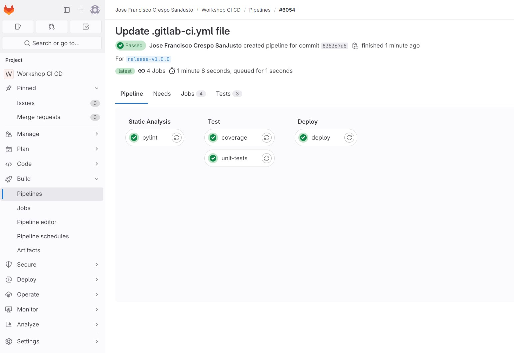
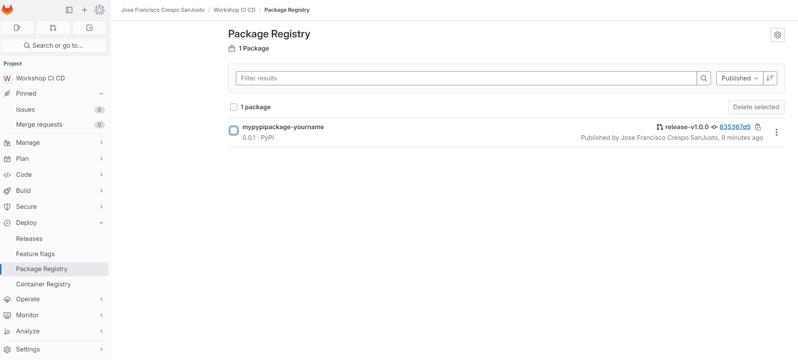

# Taller CI/CD con GitLab CI/CD

Este taller, a través de un proyecto de Python, busca mostrar cómo se puede implementar un pipeline de CI/CD utilizando GitLab CI/CD.

## Requisitos

- Tener una cuenta en GitLab.
- Tener un proyecto en GitLab.
- Tener instalado Git.


## Paso 0 - Fork de este repositorio

1. Para empezar, haz un fork de este repositorio en tu cuenta de GitLab. 
Si ya has hecho fork anteriormente, puedes actualizar tu repositorio de la siguiente manera:
    - Desde la UI: https://docs.gitlab.com/ee/user/project/repository/forking_workflow.html#from-the-ui
    

    - O bien por linea de comandos:
        ```bash
        git remote add upstream https://<repositorio-workshop>/workshop-cicd.git
        git fetch upstream
        git pull upstream master
        ```

2. El siguiente paso es clonar o actualizar tu repositorio en tu máquina local. Para ello, ejecuta los siguientes comandos en tu terminal:
    - Clonar repositorio:
        ```bash
        git clone https://<tu-repositorio>/workshop-cicd.git
        cd workshop-cicd
        ```
     - O bien actualizar repositorio:
        ```bash
        git fetch origin
        git pull origin main
        ```

## Paso 1 - Ejecuta el pipeline inicial de GitLab CI/CD
1. Abre el proyecto en GitLab.
2. Haz clic en `CI/CD` en el menú lateral.
3. Haz clic en `Run Pipeline`.
4. Selecciona la rama `main` y haz clic en `Run Pipeline`.
5. Espera a que el pipeline se ejecute.

Este pipeline inicial ejecutará la siguiente etapa:
    - Test



## Paso 2 - Personaliza el pipeline de GitLab CI/CD
1. Personaliza el pipeline:
    - Abre el archivo `.gitlab-ci.yml` en tu editor de código favorito, por ejemplo: Visual Studio Code.

2. Configura el stage "Static Analysis":
    - Agrega un nuevo stage llamado "Static Analysis" antes del stage "Test".
        ```yaml
        stages:
            - Static Analysis
            - Test
        ```
    - Agrega un nuevo job llamado "pylint" asociado al stage "Static Analysis"
        ```yaml
        pylint:
            stage: Static Analysis
            script:
                - echo "Running pylint..."
                - pylint -d C0301 -f parseable --reports=no main.py transform.py > pylint.log
            artifacts:
                paths:
                - pylint.log
        ```
    - Este analisis estático del código se ejecutará en los archivos `main.py` y `transform.py` y guardará el resultado en un archivo `pylint.log`.

3. Configura el job "coverage":
    - Agrega un nuevo job llamado "coverage" asociado al stage "Test"
        ```yaml
        coverage:
            stage: Test
            script:
                - python -m coverage run test.py 
                - python -m coverage xml -o coverage.xml
            coverage: '/TOTAL.*? (100(?:\.0+)?\%|[1-9]?\d(?:\.\d+)?\%)$/'
            artifacts:
                reports:
                    coverage_report:
                        coverage_format: cobertura
                        path: coverage.xml    
        ```
    - Este análisis de cobertura se ejecutará en el archivo `test.py` y guardará el resultado en un archivo `coverage.xml`.

4. Configura el stage "Deploy":
    - Agrega un nuevo stage llamado "Deploy" después del stage "Test".
        ```yaml
        stages:
            - Static Analysis
            - Test
            - Deploy
        ```
    - Agrega un nuevo job llamado "deploy" asociado al stage "Deploy"
        ```yaml
        deploy:
        stage: Deploy
        script:
            - pip install build twine
            - python -m build
            - TWINE_PASSWORD=${CI_JOB_TOKEN} TWINE_USERNAME=gitlab-ci-token python -m twine upload --repository-url ${CI_API_V4_URL}/projects/${CI_PROJECT_ID}/packages/pypi dist/*
        rules:
            - if: $CI_COMMIT_REF_NAME =~ /.*-v[0-9]+\.[0-9]+\.[0-9]+/
            when: always
        ```
    - Este despliegue se ejecutará en el pipeline si el nombre de la versión tiene el formato {nombre-de-la-versión}-v**x.x.x** (siendo x números).
    - Crea un tag con el formato {nombre-de-la-versión}-v**x.x.x** y haz push al repositorio de ese tag.
        ```bash
        git tag release-v1.0.0
        git push origin release-v1.0.0
        ```
    - Tambien funciona creando una rama con el formato {nombre-de-la-versión}-v**x.x.x** y haciendo push a esa rama.
        ```bash
        git checkout -b release-v1.0.0
        git push origin release-v1.0.0
        ```
        
    - Este despliegue subirá el paquete a nuestro registro de paquetes de GitLab.
    - Puedes revisar el paquete en `Deploy` -> `Package Registry`.
        
    - Puedes editar el nombre y versión del proyecto python en el archivo `pyproject.toml` y volver a ejecutar el pipeline para subir una nueva versión.

