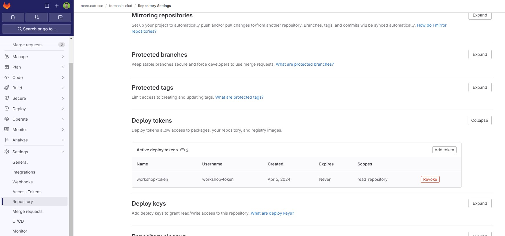
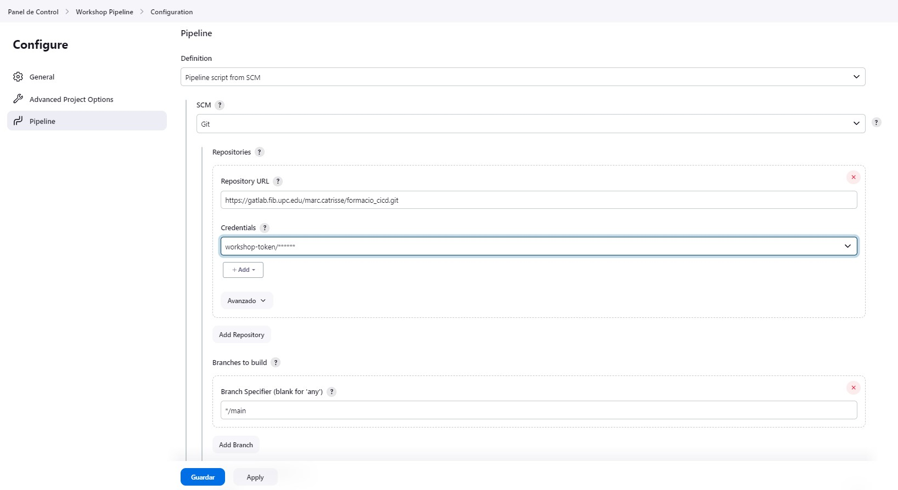

# Taller CI/CD con Jenkins

En este taller, aprenderemos cómo configurar un pipeline utilizando Jenkins con Docker para automatizar el proceso de construcción e implementación de un proyecto Python.

## Prerrequisitos
Antes de comenzar, asegúrate de tener Docker instalado:

- Docker: [Instrucciones de instalación](https://docs.docker.com/get-docker/)

## Paso 0 - Fork de este repositorio

1. Para empezar, haz un fork de este repositorio en tu cuenta de GitLab. 

2. El siguiente paso es clonar tu repositorio en tu máquina local. Para ello, ejecuta los siguientes comandos en tu terminal:
    ```bash
    git clone https://<tu-repositorio>/workshop-cicd.git
    cd workshop-cicd
    ```

3. Crea una rama para trabajar en el workshop. Por ejemplo, si vas a trabajar con Jenkins, crea una rama llamada "jenkins":
    ```bash
    git checkout -b jenkins
    ```

## Paso 1 - Configurar Jenkins con Docker

Este código configura un pipeline de Jenkins utilizando Docker para un proyecto Python.

Para iniciar Jenkins con Docker, sigue estos pasos:

1. Inicia el contenedor de Jenkins utilizando Docker Compose:
    - Abre una terminal o línea de comandos.
      ```bash
      docker compose up
      ```
    - Este comando realiza lo siguiente:
         - Inicia el contenedor de Jenkins y crea un volumen llamado "jenkins_home" para persistir los datos de Jenkins.
         - Mapea los puertos 8080 y 50000 del contenedor a los puertos 8080 y 50000 de la máquina host, respectivamente.
         - También inicia el servicio docker:dind para utilizar Docker en Docker.

2. Accede a Jenkins:
    - Abre un navegador web y navega a http://localhost:8080.
    - Sigue las instrucciones en pantalla para completar el proceso de configuración de Jenkins.
    
    - Elige "Install suggested plugins" para instalar los plugins por defecto.
    
    - Configura un usuario administrador para acceder a Jenkins.
    

5. Instala los plugins necesarios:
    - Una vez configurado Jenkins, inicia sesión con las credenciales del usuario administrador creado. 
    - Ve a "Manage Jenkins" > "Plugins" > "Available Plugins" para instalar los plugins necesarios.
    
    - Instala los plugins necesarios para crear el pipeline de este proyecto Python, como:
      - Docker
      - Docker Pipeline
      - Warnings
      - Cobertura
    - No es necesario reiniciar Jenkins después de instalar estos plugins.

6. Reinicia el servicio de Jenkins:
    - Abre una terminal o línea de comandos.
      ```bash
      docker compose restart jenkins
      ```
    - Este comando reinicia el contenedor de Jenkins con los plugins instalados.
    - NOTA: Este paso no debería ser necesario, pero sinó no detecta el agente de tipo "docker".

¡Eso es todo! Ahora has instalado Jenkins con Docker.

## Paso 2 - Configurar el pipeline de Jenkins

En este paso, crearemos un pipeline de Jenkins para automatizar el proceso de construcción e implementación de un proyecto Python.

Para crear un pipeline de Jenkins, sigue estos pasos:

1. Crea una nueva tarea:
    - Haz clic en "Nueva Tarea"/"Create a Job" en el panel de control de Jenkins.
    - Ingresa un nombre para la tarea (por ejemplo, "Workshop Pipeline") y selecciona "Pipeline" como tipo de tarea.
    
    - Haz clic en "OK" para crear la tarea.
    
2. Configura el pipeline:
    - En la página de configuración del pipeline, desplázate hacia abajo hasta la sección "Pipeline".
    - Selecciona "Pipeline script from SCM" como definición.
    - Elige "Git" como SCM.
    - Ingresa la URL del repositorio de GitLab (https) de tu repositorio.
    - Crea una nueva credencial con tu repositorio de GitLab.
    - Ve a tu cuenta de GitLab.
    - Haz clic en tu repositorio de GitLab.
    - Ve a "Settings" > "Repository" > "Deploy Tokens" > "Add token".
    - Crea un nuevo token de implementación con los permisos necesarios: "read_repository".
    
    - Agrega el token de implementación como una credencial en la configuración del pipeline.
    
    - Selecciona la credencial que creaste en el campo "Credentials".
    - Ingresa el nombre de la rama en la que estés trabajando (por ejemplo, "jenkins") en el campo "Branches to build".
    
    - Haz clic en "Save" para guardar la configuración del pipeline.

3. Ejecuta el pipeline:
    - Haz clic en "Build Now" para ejecutar el pipeline.
    - Jenkins clonará el repositorio, y ejecutará el pipeline definido en el archivo "Jenkinsfile", que incluyes los pasos de:
      - Clean workspace: Limpia el espacio de trabajo antes de ejecutar el pipeline.
      - Build: instala las dependencias del proyecto Python.
      - Deploy: espacio para configurar el despliegue del proyecto python.
    
    
    - Puedes ver el progreso y los registros del pipeline en el panel de control de Jenkins.

## Paso 3 - Personalizar el pipeline de Jenkins

En este paso, personalizaremos el pipeline de Jenkins para un proyecto Python.

1. Personaliza el pipeline:
    - Abre el archivo "Jenkinsfile" en tu editor de código favorito, por ejemplo: Visual Studio Code.
2. Configura el stage "Static Analysis":
    - Este stage ejecuta el análisis de código estático con Pylint.
    - Copia el siguiente texto en el Pipeline:
      ```groovy
        // Static Analysis stage to run PyLint and publish report
        stage('Static Analysis') {
            steps {
                echo "Running PyLint"
                sh '''
                    . .venv/bin/activate
                    pylint -d C0301 -f parseable --reports=no main.py transform.py > pylint.log || echo "pylint exited with $?"
                '''
            }
            environment {
                PYLINTHOME = '.pylint.d'
            }
            post {
                always {
                    echo 'Publishing PyLint Report'
                    sh 'cat pylint.log'
                    recordIssues(
                        healthy: 1, 
                        tools: [pyLint(name: 'Python Project', pattern: '**/pylint.log')], 
                        unhealthy: 2
                    )
                }
            }
        }
      ```
    - Haz commit y push de los cambios en el archivo "Jenkinsfile" a tu repositorio de GitLab.
    - Comprueba que el pipeline se ejecute correctamente y que el análisis de código estático se realice correctamente.
    - Puedes ver los resultados del análisis de código estático en el panel de control de Jenkins.

3. Configura el stage "Unit Test":
    - Este stage ejecuta las pruebas unitarias y genera un informe de pruebas.
    - Copia el siguiente texto en el Pipeline:
      ```groovy
        // Unit tests stage to run PyTest and publish JUnit report
        stage('Unit tests') {
            steps {
                echo 'Running Unit tests'
                sh  '''
                    . .venv/bin/activate
                    python -m pytest --verbose --junit-xml reports/junit.xml test.py
                '''
            }
            post {
                always {
                    archiveArtifacts 'reports/junit.xml'
                    junit(testResults: 'reports/junit.xml', allowEmptyResults: false)
                }
            }
        }
      ```
      - Haz commit y push de los cambios en el archivo "Jenkinsfile" a tu repositorio de GitLab.
      - Comprueba que el pipeline se ejecute correctamente y que las pruebas unitarias se realicen correctamente.
      - Puedes ver los resultados de las pruebas unitarias en el panel de control de Jenkins.

4. Configura el stage "Coverage":
    - Este stage ejecuta las pruebas con cobertura y genera un informe de cobertura.
    - Copia el siguiente texto en el Pipeline:
      ```groovy
        // Coverage stage to run coverage and publish Cobertura report
        stage('Coverage') {
            steps {
                echo 'Running coverage'
                sh '''
                    . .venv/bin/activate
                    coverage run test.py 
                    coverage report -m
                    coverage xml -o reports/coverage.xml
                '''
            }
            post {
                always {
                    archiveArtifacts 'reports/coverage.xml'
                    cobertura(
                        autoUpdateHealth: false,
                        autoUpdateStability: false,
                        coberturaReportFile: 'reports/coverage.xml',
                        conditionalCoverageTargets: '70, 0, 0',
                        failUnhealthy: false,
                        failUnstable: false,
                        lineCoverageTargets: '80, 0, 0',
                        maxNumberOfBuilds: 0,
                        methodCoverageTargets: '80, 0, 0',
                        onlyStable: false,
                        sourceEncoding: 'ASCII',
                        zoomCoverageChart: false
                    )
                }
            }
        }
      ```


## Paso 4 - Instala plugins BlueOcean (opcional)

Instala el plugin BlueOcean para visualizar el pipeline de una manera más amigable.

Para instalar el plugin BlueOcean, sigue estos pasos:
- Ve a "Manage Jenkins" > "Manage Plugins" > "Available" > "Blue Ocean".
- Haz clic en "Install without restart" para instalar el plugin.
- Una vez instalado, ve a la página principal de Jenkins y haz clic en "Open Blue Ocean" para ver el pipeline con la interfaz de usuario de Blue Ocean.

## Paso 5 - Configurar notificaciones en el pipeline de Jenkins (opcional)

Intenta instalar cualquier plugin de notificación para recibir notificaciones cuando se ejecute el pipeline

Para instalar un plugin de notificación, sigue estos pasos:
- Enviar notificaciones en el Pipeline: https://www.jenkins.io/doc/pipeline/tour/post/
- Notificaciones de Slack: https://plugins.jenkins.io/slack/
- Notificaciones por correo electrónico: https://plugins.jenkins.io/email-ext/
- Notificaciones de Telegram: https://plugins.jenkins.io/telegram-notifications/
- Notificaciones de Microsoft Teams: https://blog.devops.dev/jenkins-notifications-with-microsoft-teams-2cf60aab4451
